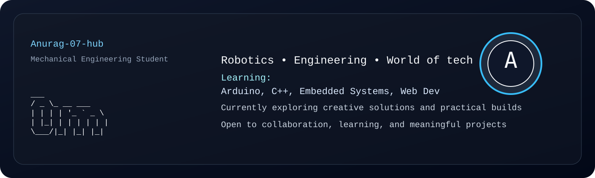

<picture>
  <source media="(prefers-color-scheme: dark)" srcset="dark_mode.svg" />
  <source media="(prefers-color-scheme: light)" srcset="light_mode.svg" />
  
</picture>

 - 👋 Hi, I’m @Anurag-07-hub
 - Mechanical Engineering Students which has  to learn a lot and to do some creativity.
 - 👀 I’m interested in ... Robotics,Engineering and the chemistry of the world and I Love watch Youtube videos the most
 - 🌱 I’m currently learning ...Arduino programming, C++ Programming and doing a diploma course in Sant Longowal institute of engineering and Technology
 - 💞️ I’m looking to collaborate on ...
 - 📫 How to reach me ...You can Reach me by Sending an Email..
 - 😄 Pronouns: ...
 - ⚡ Fun fact: ...

<!---
Anurag-07-hub/Anurag-07-hub is a ✨ special ✨ repository because its `README.md` (this file) appears on your GitHub profile.
You can click the Preview link to take a look at your changes.
--->
