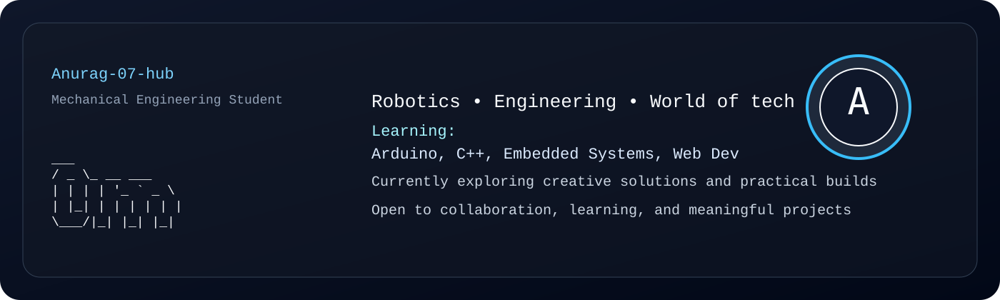

  <picture>
    <source media="(prefers-color-scheme: dark)" srcset="dark_mode.svg" />
    <source media="(prefers-color-scheme: light)" srcset="light_mode.svg" />
    
  </picture>

  
<i>⚙️ Building robotics, electronics, and creative engineering ideas.</i>

---

## About

- 👋 Hi, I'm @Anurag-07-hub
- Mechanical Engineering student exploring robotics, electronics, and creative engineering projects.
- 🌱 Currently learning Arduino programming, C++, and practical engineering workflows.
- 📫 Reach me at: anurag852007@gmail.com
